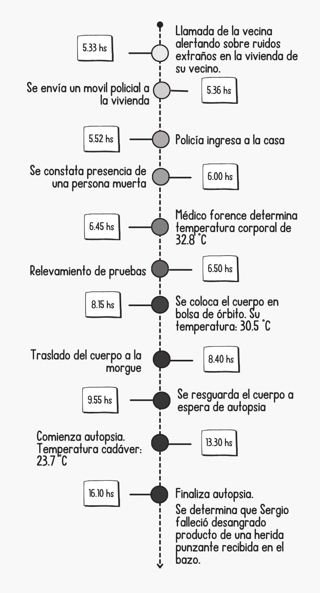

```{r setup, echo=FALSE}
knitr::opts_chunk$set(echo = FALSE, warning = FALSE, message = FALSE,
                      fig.height = 3)
```

```{r}
# Carga de librerías
library(ggplot2)
library(dplyr)
library(kableExtra)
library(rstan)
library(bayesplot)
library(tidyr)

set.seed(425641446)
```

## Introducción

Guido es un estudiante de estadística que, por ser fanático de CSI: Crime Scene Investigations hoy cumple su sueño formando parte de la policía científica de Córdoba. Pero no todo es color de rosa. En realidad, Guido está viviendo una pesadilla traumática desde la madrugada del pasado miércoles, cuando su unidad de Salsipuedes fue convocada para investigar un crimen que, aparentemente, acababa de ser cometido. 

Al llegar al lugar, el caos se extendía por toda la habitación. Muebles volcados y destrozados, utensilios de cocina desparramados y manchados con sangre, vidrios estallados y manchas de sangre en las paredes y en el piso. Guido se encontraba paralizado. Su respiración era agitada y sus manos transpiraban. Cuando creía que esta era la peor película de terror de su vida.. Ahí estaba, el cuerpo de Sergio Contreras ahogándose en un charco de sangre. 

En ese momento Guido entró en shock. Su psicóloga le dijo que por ello perdió sus conocimientos de estadística, pero que con el tiempo volverán. Mientras tanto, dado que por suerte nosotras no perdimos nuestros conocimientos estadísticos, el cordobés nos pidió ayuda para resolver el caso. Para que Guido no pierda su trabajo, nos ponemos más serias.

## Objetivo 

El objetivo de este trabajo es averiguar la hora de muerte de Sergio Contreras, quien murió desangrado, producto de una herida punzante recibida en el bazo, en su casa en la localidad cordobesa de Salsipuedes.

## Metodología

La tanatocronología, derivada de las palabras griegas "thanatos" (muerte) y "chronos" (tiempo), es un subcampo de la medicina forense que se centra en determinar el intervalo postmortem, es decir, el tiempo transcurrido desde la muerte hasta el descubrimiento del cadáver.[^1]

[^1]: Fuente: [\textcolor{blue}{\underline{Diccionario Médico: tanatocronología - Clínica Universidad de Navarra}}](https://www.cun.es/diccionario-medico/terminos/tanatocronologia#:~:text=La%20tanatocronolog%C3%ADa%2C%20derivada%20de%20las,hasta%20el%20descubrimiento%20del%20cad%C3%A1ver.)

Desde el momento de la muerte, comienza en el cuerpo humano una serie de procesos químicos y físicos que se conocen como fenómenos cadavéricos.
Uno de ellos es el enfriamiento del cuerpo (enfriamiento postmortem o *algor mortis*).

En este proceso, la temperatura del cadáver desciende hasta igualarse con la temperatura ambiente, y este descenso ocurre más rápido en las primeras horas después de la muerte.

\newpage

##  Resumen de los hechos ocurridos

Para resolver la interrogante de este trabajo, se cuenta con la siguiente cronología de hechos:

```{r, echo=FALSE, out.width='50%', fig.align='center'}

```

## Desarrollo

La Ley de enfriamiento de Newton establece que la tasa de cambio de la temperatura de un objeto (en este caso un cadáver) es proporcional a la diferencia entre la temperatura del objeto y la temperatura del ambiente en el que se encuentre.

Esta Ley se puede expresar matemáticamente como:

$$\frac{dT(t)}{dt}=r[T_{\mathrm{amb}}-T(t)]\tag{1}$$

donde $T(t)$ es la temperatura del cuerpo en el tiempo $t$, $T_{amb}$ es la temperatura ambiente y $r$ es una constante de proporcionalidad que depende de las características del cadáver y del ambiente.

Una posible solución a esta ecuación viene dada por:

$$T(t)=T_{\mathrm{amb}}+(T_i-T_{\mathrm{amb}})e^{-kt}$$
donde
$T_i$ es la temperatura inicial del cadáver.

La misma satisface la ecuación $(1)$ ya que: 

\begin{align*}
\frac{dT(t)}{dt} &= (T_i - T_{\text{amb}}) \cdot (-r) \cdot e^{-rt} \\
&= -r \cdot [(T_i - T_{\mathrm{amb}}) \cdot e^{-rt}] \\
&= -r \cdot [-T_{\mathrm{amb}} + T_{\mathrm{amb}} + (T_i - T_{\mathrm{amb}}) \cdot e^{-rt}] \\
&= -r \cdot [-T_{\mathrm{amb}} + T(t)] \\
&= r \cdot [T_{\mathrm{amb}} - T(t)]
\end{align*}

Con el objetivo de obtener un valor realista de $r$, se grafica la función $T(t)$ con distintos valores de esta constante. Para esto, se considera una temperatura inicial del cuerpo de 37 Cº y una temperatura ambiente de 23 Cº.

```{r, fig.align='center'}
# Gráfico de la temperatura del cuerpo a través del tiempo
t_amb <- 23
t_i <- 37
t <- seq(0, 35, by = 1)
r <- c(0.1, 0.2, 0.3)

funcion_t <- function(t_amb, t_i, t, r) {
  t_amb + (t_i- t_amb) * exp(-r*t)
}

funcion_t_vector <- Vectorize(funcion_t)

df_T <- data.frame(
  t_amb = t_amb,
  t_i = t_i,
  t = rep(seq(0, 35, by = 1), times = length(r)),
  r = rep(r, each = length(t))
)

df_T <- df_T %>% 
  mutate(func_t = funcion_t_vector(df_T$t_amb, df_T$t_i, df_T$t, df_T$r))

ggplot(df_T) +
  geom_line(aes(x = t, y = func_t, color = factor(r)), linewidth = 1) +
  scale_x_continuous(breaks = seq(0, 40, by = 5), name = "Hora (t)") +
  scale_y_continuous(breaks = seq(23, 39, by = 2), name = "T(t)") +
  scale_color_manual(values = c("orchid3", "palegreen3", 'gold'), name = "r") +
  geom_hline(yintercept = 23, linetype = "dashed") +
  labs(caption = "Figura 1: Gráfica de la función de descenso de la temperatura corporal T(t) para 3 valores de la constante r,\n con una temperatura inicial del cuerpo de 37 Cº hasta alcanzar una temperatura ambiente de 23 Cº") +
  theme_bw() +
  theme(plot.caption = element_text(hjust = 0.5))
```

Como se mencionó anteriormente, *r* es una constante de proporcionalidad que depende de las características del cadáver y del ambiente. Ésta, representa la conductividad entre el cuerpo y la superficie de contacto. A valores más altos de *r*, más rápido será el descenso de la temperatura corporal.

Los órganos abdominales pueden mantener el calor por al menos 24 horas.
En las primeras 12 horas se va perdiendo el calor de 0.8 a 1.0 °C por hora y en las siguientes 12 horas de 0.3 a 0.5 grados centígrados.[^2]

[^2]: Fuente: [\textcolor{blue}{\underline{Fenómenos cadavéricos - Valentina Gómez Hernández}}](https://repository.unad.edu.co/bitstream/handle/10596/51040/vgomezh.pdf?sequence=3&isAllowed=y#:~:text=Enfriamiento%20Cadav%C3%A9rico%20o%20Algor%20Mortis,equilibra%20con%20el%20medio%20ambiente.)

Sin embargo, el cuerpo de Sergio no está sufriendo un enfriamiento postmortem regular, puesto que falleció desangrado. La sangre retiene calor y distribuye la temperatura uniformemente en el cuerpo. Sin sangre, el cuerpo pierde calor más rápidamente. Esto podría llevar a pensar que la constante de proporcionalidad sea un poco más alta que en una situación de muerte por causa natural.

Teniendo en cuenta esta información y lo observado en la Figura 1, se puede considerar que un valor razonable para *r* se encuentra entre 0.1 y 0.3.

### Postulación del modelo

Para mayor simplicidad a la hora de construir un modelo, en lugar de trabajar con la temperatura del cuerpo se decide utilizar la diferencia entre la temperatura del mismo y la temperatura ambiente $T(t) - T_{\mathrm{amb}}$.
Además, se define $T_{\mathrm{diff}} = T_i - T_{\mathrm{amb}}$; por lo que se obtiene finalmente que $T(t) - T_{\mathrm{amb}} = T_{\mathrm{diff}} \cdot e ^ {-rt}$.

Se demuestra a continuación un resultado que será de vital importancia para la construcción de un modelo: el logaritmo natural de la nueva variable $T(t) - T_{\mathrm{amb}}$ es una función lineal de *t*.

$$ \ln(T(t) - T_{\mathrm{amb}}) = \ln( T_{\mathrm{diff}} \cdot e^{-rt}) = \ln(T_{\mathrm{diff}}) + (-rt) \cdot \ln (e) = \ln(T_{\mathrm{diff}}) - rt = \beta_{0} + \beta_{1}\cdot t \tag{2}$$

Dado que se desconoce la hora de muerte de Sergio, se toma como momento 0 al tiempo en el que ocurre la primer medición de temperatura al cuerpo. 

De esta manera, se puede interpretar a $\beta_{0}$ como el valor del $\ln(T(t) - T_{\mathrm{amb}})$ al momento de la primer medición, es decir, cuando $t=0$. Al exponenciar ambos miembros se obtiene que 
$$ T(t=0) - T_{\mathrm{amb}} = e^{\beta_0}$$
Por lo que la temperatura del cuerpo a las 6:45hs (hora de la primer medición) es igual a $e^{\beta_0} + T_{\mathrm{amb}}$

$\beta_1$ es el opuesto de la constante de conductividad y representa el cambio en el logaritmo de la diferencia entre la temperatura corporal y la temperatura ambiente por cada hora transcurrida.

Para determinar la hora de muerte de Sergio, se trabajará con un modelo lineal bayesiano; se determinarán creencias a priori para los parámetros desconocidos para luego actualizarlas con las mediciones de \mbox{temperatura} que se realizaron al cuerpo del hombre.
Para este proceso, se considera que la temperatura ambiente (constante a través del tiempo) es de 22ºC.

El modelo propuesto incompleto, dado que faltan las distribuciónes a priori de sus parámetros, es el siguiente:

$$
\begin{cases} 
\ln(T(t) - T_{\mathrm{amb}}) \sim\mathcal{N}_{(\mu, \sigma)} \\
\mu = \beta_{0} + \beta_{1}\cdot t
\end{cases}
$$

Se asignarán distribuciones a priori para los parámetros desconocidos $\beta_0$, $\beta_1$ y $\sigma$.
Si bien $\mu$ también es desconocido, no se le asigna un prior propio ya que su valor depende exclusivamente de $\beta_0$ y $\beta_1$, de forma que una vez asignados valores para estos dos parámetros, $\mu$ queda definido.

Como se menciona en la ecuación (2), $\beta_0$ es el $\ln(T_{\mathrm{diff}}) = \ln(T_i - T_{\mathrm{amb}})$ cuando $t=0$ (A las 6:45hs).
Se sabe que la temperatura ambiente es de 22ºC, y que a las 5:33hs la vecina de Sergio escuchó ruidos provenientes de su casa. La primer medición de temperatura se hizo a las 6:45hs. Entonces, se puede pensar que al momento de la primer medición Sergio llevaba muerto entre 1 y 2 horas. En ese tiempo, es de esperar que la temperatura de su cuerpo haya descendido entre 2 y 6 °C, como mucho.
Si se considera la temperatura normal del cuerpo humano en 36.5 ºC, entonces el $\ln(T(t) - T_{\mathrm{amb}})$ máximo es $\ln((36.5-2) - 22) = 2.526$ y el mínimo es $\ln((36.5-6) - 22) = 2.14$. 
A partir de esto, se puede suponer a priori una distribución normal para $\beta_0$ de media $\mu_{\beta_0} = \frac{2.526 + 2.14}{2}=2.333$ y desvío $\sigma_{\beta_0} = \frac{2.526-2.333}{3} = 0.064$, quedando así definido su prior.

Para definir una distribución para $\beta_1$, se puede utilizar la Figura 1; si bien el gráfico se realizó para una temperatura ambiente 1 ºC más alta que la actual, las conclusiones no deberían cambiar tanto.
Si en una situación de causa de muerte natural, un valor lógico para *r* se encuentra entre 0.1 y 0.2. Entonces, se puede considerar que como Sergio murió desangrado y la pérdida de sangre puede acelerar el descenso de la temperatura corporal, un valor razonable para *r* será entre 0.15 y 0.3.
De esta manera, se puede decir que $\beta_1 = -r$ toma valores entre -0.3 y -0.15.
Por eso se propone a priori una distribución normal de media $\mu_{\beta_1} = \frac{-0.3-0.15}{2} = -0.225$ y desvío $\sigma_{\beta_1} = \frac{-0.15+0.225}{3} = 0.025$.

Por último, $sigma$ es el desvío del $\ln(T(t) - T_{\mathrm{amb}})$.
La diferencia máxima entre la temperatura ambiente (22ºC) y $T(t)$ se da cuando $T(t)$ es 36.5 °C.
En ese caso, $\ln(36.5-22)=2.67$.
La diferencia mínima es de cero grados, y se da cuando la temperatura del cuerpo alcanza la temperatura ambiente, pero ahí el logaritmo no existe.

Como el desvío de una distribución es estrictamente positivo, se propone para el mismo una distribución Half-normal, con desvío $\sigma_\sigma = \frac{2.67}{3} = 0.89$.

Por lo tanto, si se consideran independientes los parámetros entre sí, el modelo con las distribuciones a priori propuestas es:

$$
\begin{cases}
\ln(T(t) - T_{\mathrm{amb}}) \sim\mathcal{N}_{(\mu, \sigma)} \\
\mu = \beta_{0} + \beta_{1}\cdot t \\
\\
\beta_0 \sim \mathcal{N}_{(2.333, 0.064)} \\
\beta_1 \sim \mathcal{N}_{(-0.225, 0.025)} \\
\sigma \sim \mathcal{N}^{+}_{(0.89)}
\end{cases}
$$ Se realizan pruebas predictivas a priori para este modelo.

```{r}
mu_b0 <- 2.333
sigma_b0 <- 0.064
mu_b1 <- -0.225
sigma_b1 <- 0.025

observaciones <- tibble(tiempo = c(0, 1.5, 6.75),
                        y = c(2.38,2.14,0.53))

parametros <-
  expand.grid(b0 = seq(mu_b0-(3*sigma_b0), mu_b0+(3*sigma_b0),length.out = 50),
              b1 = seq(mu_b1-(3*sigma_b1), mu_b1+(3*sigma_b1),length.out = 50)) |>
  mutate(prior = purrr::map2_dbl(
    b0, b1,~mvtnorm::dmvnorm(x = c(.x,.y),
                                   mean = c(mu_b0, mu_b1),
                                   sigma = diag(c(sigma_b0, sigma_b1),2))))

rectas_prior <- 
  ggplot(data = observaciones) +
  geom_abline(data = parametros %>%
  slice_sample(n = 50, weight_by = prior), mapping = aes(slope=b1, intercept=b0),alpha = 0.3, size = 1) +
  geom_point(aes(x=tiempo, y=y), size = 3, color = 'honeydew4') +
  lims ( x= c(-3,7.5),y=c(0.5,4)) +
  theme_bw() +
  labs(caption = 'Figura 2: rectas predictivas a priori')+
  theme(plot.caption = element_text(hjust = 0.5))

rectas_prior
```

En la figura 2, se puede ver que el prior es bastante compatible con las observaciones.
También se puede notar que los 3 puntos no están alineados.
Esto puede deberse a que, si bien se probó que el logaritmo natural $T(t) - T_{\mathrm{amb}}$ es una función lineal de *t*, se está suponiendo que la temperatura ambiente es fija cuando la última medición se realizó habiendo trasladado el cuerpo, por lo que sería raro que la temperatura ambiente realmente se mantenga.

### Primer observación
Utilizando la información disponible hasta las 7 de la mañana, se actualiza el modelo. Se cuenta únicamente con un solo dato: la temperatura del cuerpo de Sergio en la primer medición (6:45hs) fue de 32.8ºC.

```{r, results='hide'}
# Modelo actualizado con 1 sola observación
datos1 <- data.frame(
  t = c(0),
  temp = c(32.8)
)

t_amb <- 22

stan_data1 <- list(
  N = nrow(datos1),
  t = array(datos1$t,dim=1),
  temp_obs= array(datos1$temp, dim=1),
  y = array(log(datos1$temp - t_amb), dim=1)
)

#str(stan_data1)

stan_model1 <- stan(
  file = "modelo.stan",
  chains = 4,
  data = stan_data1,
  refresh = 1,
  seed = 20000,
  iter=3000,
  warmup = 1000,
  control = list(adapt_delta = 0.95)
)

summary(stan_model1)
```

$$
\begin{array}{c|cc|cc}
\text{Parámetro} &\text{Media} &\text{desvío} & \hat{R} & \text{Número efectivo de muestras} \\
\hline
\beta_0 & 2.345 & 0.058 & 1.0002 & 4111 \\
\beta_1 & -0.22 & 0.025 & 1.0006 & 4630 \\
\sigma & 0.343 & 0.383 & 1.0005 & 3919 \\
\end{array}
$$ 

Los 3 parámetros tienen un $\hat{R} \cong 1$ lo cual se tracude en la convergencia de las cadenas utilizadas a la hora del muestreo y un número efectivo de muestras muy alto teniendo en cuenta que se plantean 3000 muestras (se usan 1000 como *warmup*) y que la probabilidad de aceptación fue del 0.95. 
Además, se aprecia en la Figura 3 que las cadenas, en cada trace plot, se mezclan entre si indicando que son similares y recorren bien la distribución establecida para los parámetros.

```{r, fig.height = 4}
# Evaluamos la calidad de las muestras
mcmc_trace(
  stan_model1, 
  pars = c("beta0", "beta1", "sigma"),
  facet_args = list(nrow = 3), 
) +
  labs(caption = "Figura 3: Trace plot por parámetro -Modelo n°1-") +
  theme_bw() +
  theme(plot.caption = element_text(hjust = 0.5))
```

Por lo que, considerando solo 1 observación, el modelo se renueva y queda definido de la siguiente manera:

$$
\begin{cases}
\ln(T(t) - T_{\mathrm{amb}}) \sim\mathcal{N}_{(\mu, \sigma)} \\
\mu = \beta_{0} + \beta_{1}\cdot t \\
\\
\beta_0 \sim \mathcal{N}_{(2.345, 0.058)} \\
\beta_1 \sim \mathcal{N}_{(-0.22, 0.025)} \\
\sigma \sim \mathcal{N}^{+}_{(0.383)}
\end{cases}
$$

Con él (el modelo) se realizan curvas *a posteriori* para poder dar una primera aproximación sobre la hora de muerte de Sergio.

```{r, fig.height=3}
# Primera observacion
datos_transf1 <- data.frame(
  t = c(0),
  temp = c(log(32.8-22))
)

calc_likelihood <- function(datos, b0, b1, sd){
  lik_i <- dnorm(datos$temp, b0+b1*datos$t, sd)
  return(prod(lik_i))
}

dv1 <-
  datos_transf1 %>% 
  slice(1) %>% 
  tidyr::crossing(parametros) %>% 
  nest(datos_transf1 = c(t,temp)) %>%
  mutate(likelihood = purrr::pmap_dbl(list(datos = datos_transf1, 
                                           b0 = parametros$b0, 
                                           b1 = parametros$b1, sd = 0.6),
                                      calc_likelihood)) %>%
  mutate(posterior = likelihood*prior) %>%
  select(-datos_transf1)

# Obtenemos las rectas muestreadas de b0 y b1
muestra1 <- dv1 %>% 
  slice_sample(n = 50, weight_by = posterior)

# Obtenemos el intervalo de la muerte de Sergio
y_objetivo <- log(36.5-22)
intercepto_rectas1 <- data.frame(b0 = muestra1$b0, b1=muestra1$b1)
intercepto_rectas1 <-  intercepto_rectas1 %>%
  mutate(t = (y_objetivo - b0)/b1)
lim_inf1 <- min(intercepto_rectas1$t)
lim_sup1 <- max(intercepto_rectas1$t)

# Función para convertir las rectas en curvas, transformando la variable Y
generacion_datos_curvas <- function(b0, b1) {
  data.frame(
    t = seq(-4, 8, by = 0.1),
    T_t = 22 + exp(b0 + b1 * seq(-4, 8, by = 0.1))
  )
}

# Creamos un data frame con todas las curvas
datos_curvas1 <- muestra1 %>%
  group_by(b0, b1) %>%
  do(generacion_datos_curvas(.$b0, .$b1))

# Graficamos las observaciones y las curvas
rectas_posterior1 <-
  ggplot(datos1) +
  geom_line(data = datos_curvas1,
            mapping = aes(x = t, y = T_t,group = interaction(b0, b1)),
            alpha = 0.3, size = 1) +
  geom_hline(yintercept = 36.5, linetype = "dashed")  +
  geom_point(data=observaciones, aes(x=tiempo, y=exp(y)+22),
             size = 3, color = 'honeydew4') +
  geom_point(aes(x = t, y = temp), size = 4, color = "firebrick3") +
  geom_vline(xintercept = lim_inf1, linetype = "dashed", color = "indianred1") +
  geom_vline(xintercept = lim_sup1, linetype = "dashed", color = "indianred1") +
  labs(x="Tiempo en horas",y="T(t)", caption = "Figura 4: Posibles curvas a posteriori -Modelo n°1-")+
  scale_x_continuous( breaks = seq(-4, 8, by = 2), labels = seq(2.45, 14.45, by = 2),expand = c(0, 0)) +
  theme_bw() +
  theme(plot.caption = element_text(hjust = 0.5))

rectas_posterior1
```

Según la Figura 4, Sergio se habría muerto entre aproximadamente las 3:30hs y las 6:00hs. Este es un intervalo muy grande de tiempo y Guido sabe que sus superiores lo mirarán de mala manera si él informa ese lapso de tiempo, por lo que brinda a sus "ayudantes" un poco más de información para ver si se logra achicar el intervalo.

### Dos cabezas piensan mejor que una
Ahora se conocen datos que fueron recabados entre las 7 y las 10 de la mañana y se suma una observación para actualizar el modelo: la segunda medición al cuerpo de Sergio (realizada a las 8:15hs) arrojó una temperatura corporal de 30.5°C.

```{r, results='hide'}
datos2 <- data.frame(
  t = c(0, 1.5),
  temp = c(32.8, 30.5)
)

stan_data2 <- list(
  N = nrow(datos2),
  t = datos2$t,
  temp_obs= datos2$temp,
  y = log(datos2$temp - t_amb)
)

#str(stan_data2)

stan_model2 <- stan(
  file = "modelo.stan",
  chains = 4,
  data = stan_data2,
  refresh = 1,
  seed = 20000,
  iter= 3000,
  warmup = 1500,
  control = list(adapt_delta = 0.95)
)

summary(stan_model2)
```

$$
\begin{array}{c|cc|cc}
\text{Parámetro} &\text{Media} &\text{desvío} & \hat{R} & \text{Número efectivo de muestras} \\
\hline
\beta_0 & 2.362 & 0.058 & 1.0007 & 2173 \\
\beta_1 & -0.216 & 0.026 & 1.003 & 1908 \\
\sigma & 0.231 & 0.253 & 1.0003 & 2493 \\
\end{array}
$$
Se puede concluir que las cadenas usadas para el muestreo convergen dado que los $\hat{R}$ resultaron, nuevamente, próximos a 1 para los 3 parámetros. Sin embargo el número efectivo de muestras se ve disminuido en relación al apartado anterior ("Primer observación), aunque se debe tener en cuenta que si bien la cantidad de muestras pedidas fue la misma (3000) se utilizó la mitad de ellas como *warmup*, mientras que la probabilidad de aceptación de una muestra se mantuvo (0.95).
Acompañando estas conclusiones, se tiene la Figura 5; ella muestra que las cadenas estarían recorriendo la totalidad de los priors y las 4 cadenas empleadas se entremezclan indicando la baja variabilidad entre ellas. Por lo tanto, parecería que la muestra obtenida es buena. 

```{r, fig.height=4}
mcmc_trace(
  stan_model2, 
  pars = c("beta0", "beta1", "sigma"),
  facet_args = list(nrow = 3)
) +
  labs(caption = "Figura 5: Trace plot por parámetro -Modelo n°2-") +
  theme_bw() +
  theme(plot.caption = element_text(hjust = 0.5))
```


Luego de considerar la nueva observación, el nuevo modelo es el siguiente:

$$
\begin{cases}
\ln(T(t) - T_{\mathrm{amb}}) \sim\mathcal{N}_{(\mu, \sigma)} \\
\mu = \beta_{0} + \beta_{1}\cdot t \\
\\
\beta_0 \sim \mathcal{N}_{(2.362, 0.058)} \\
\beta_1 \sim \mathcal{N}_{(-0.216, 0.026)} \\
\sigma \sim \mathcal{N}^{+}_{(0.253)}
\end{cases}
$$

Se generan posibles curvas *a posteriori* y se las analiza para dar una nueva aproximación al horario de muerte de Sergio.

```{r, fig.height=3}
datos_transf2 <- data.frame(
  t = c(0, 1.5),
  temp = c(log(32.8-22),log(30.5-22))
)

dv2 <-
  datos_transf2 %>% 
  slice(c(1,2)) %>%
  tidyr::crossing(parametros) %>% 
  nest(datos_transf2 = c(t,temp)) %>%
  mutate(likelihood = purrr::pmap_dbl(list(datos = datos_transf2, b0 = parametros$b0, b1 = parametros$b1, sd = 0.6),
                                      calc_likelihood)) %>%
  mutate(posterior = likelihood*prior) %>%
  select(-datos_transf2) 

# Obtenemos las rectas muestreadas de b0 y b1
muestra2 <- dv2 %>% 
  slice_sample(n = 50, weight_by = posterior)

# Obtenemos el intervalo de la muerte de Sergio
y_objetivo <- log(36.5-22)
intercepto_rectas2 <- data.frame(b0 = muestra2$b0, b1=muestra2$b1)
intercepto_rectas2 <-  intercepto_rectas2 %>%
  mutate(t = (y_objetivo - b0)/b1)
lim_inf2 <- min(intercepto_rectas2$t)
lim_sup2 <- max(intercepto_rectas2$t)

# Función para convertir las rectas en curvas, transformando la variable Y
generacion_datos_curvas <- function(b0, b1) {
  data.frame(
    t = seq(-4, 8, by = 0.1),
    T_t = 22 + exp(b0 + b1 * seq(-4, 8, by = 0.1))
  )
}

# Creamos un data frame con todas las curvas
datos_curvas2 <- muestra2 %>%
  group_by(b0, b1) %>%
  do(generacion_datos_curvas(.$b0, .$b1))

# Graficamos las observaciones y las curvas
rectas_posterior2 <-
  ggplot(datos2) +
  geom_line(data = datos_curvas2,
            mapping = aes(x = t, y = T_t,group = interaction(b0, b1)),
            alpha = 0.3, size = 1) +
  geom_hline(yintercept = 36.5, linetype = "dashed")  +
  geom_point(data=observaciones, aes(x=tiempo, y=exp(y)+22),
             size = 3, color = 'honeydew4') +
  geom_point(aes(x = t, y = temp), size = 4, color = "firebrick3") +
  geom_vline(xintercept = lim_inf2, linetype = "dashed", color = "indianred1") +
  geom_vline(xintercept = lim_sup2, linetype = "dashed", color = "indianred1") +
  labs(x="Tiempo en horas",y="T(t)", caption = "Figura 6: Posibles curvas a posteriori -Modelo n°2-")+
 scale_x_continuous( breaks = seq(-4, 8, by = 2), labels = seq(2.45, 14.45, by = 2),expand = c(0, 0)) +
  theme_bw() +
  theme(plot.caption = element_text(hjust = 0.5))

rectas_posterior2
```
La Figura 6 pareciera que no difiere demasiado de la Figura 4 (apartado "Primer observación") sin embargo, para desgracia de Guido, el lapso de tiempo se vió aumentado por algunos minutos. En este caso, la figura muestra que Sergio se murió entre las 3:30hs y aproximadamente las 6:10hs.
Indignado Guido por este suceso y casi al borde de la histeria por no poder resolver la incognita, decide brindar más información y ponerse a rezar para que esta sea suficiente para poner fin al misterio que supone la hora de muerte de Sergio.


### Donde entran dos, entran tres
En esta ocasión, al listado de conocimiento que poseen las "ayudantes" de Guido, se le suma todos los detalles que él obtuvo hasta las 16:10 de la tarde; entre ellos está una nueva temperatura medida al cuerpo del pobre Sergio, realizada a las 13:30 al inicio de la autopsia: 23.7°C 

```{r, results='hide'}
#Se arma una tabla con las temperaturas del cuerpo observadas y los tiempos
datos3 <- data.frame(
  t = c(0, 1.5, 6.75),
  temp = c(32.8, 30.5, 23.7)
)

t_amb <- 22

stan_data3 <- list(
  N = nrow(datos3),
  t = datos3$t,
  temp_obs= datos3$temp,
  y = log(datos3$temp - t_amb)
)

str(stan_data3)

stan_model3 <- stan(
  file = "modelo.stan",
  chains = 4,
  data = stan_data3,
  refresh = 1,
  seed = 20000,
  iter = 2500,
  warmup = 1500,
  control = list(adapt_delta = 0.95)
)


summary(stan_model3)
```

$$
\begin{array}{c|cc|cc}
\text{Parámetro} &\text{Media} &\text{desvío} & \hat{R} & \text{Número efectivo de muestras} \\
\hline
\beta_0 & 2.338 & 0.06 & 1.0004 & 2552 \\
\beta_1 & -0.238 & 0.022 & 1.001 & 2241 \\
\sigma & 0.287 & 0.21 & 1.004 & 1547 \\
\end{array}
$$

La muestra adquirida resulta buena ya que los valores de $\hat{R}$ obtenidos comunican que las cadenas convergieron por tercera vez. Esto acompaña a la Figura 7, la cual muestra, al igual que los casos previos, que estas se mezclan bien entre si representando la baja variabilidad que hay entre ellas y que recorren de manera adecuada la distribucion *a priori* de los 3 parámetros.

Por otro lado, se tienen números efectivos de muestra dentro de un rango similar a los obtenidos en la situación con 2 observaciones pese a haber disminuido la cantidad de muestras totales pedidas (de 3000 pasaron a 2500). La probabilidad de aceptación de una muestra y la cantidad de muestras utilizadas a modo de *warmup* se mantuvieron en los mismo valores (0.95 y 1500 respectivamente).

```{r, fig.height=4}
mcmc_trace(
  stan_model3, 
  pars = c("beta0", "beta1", "sigma"),
  facet_args = list(nrow = 3)
) +
  labs(caption = "Figura 7: Trace plot por parámetro -Modelo n°3-") +
  theme_bw() +
  theme(plot.caption = element_text(hjust = 0.5))
```

Con las 3 temperaturas que se le registraron al muerto, el modelo queda finalmente determinado de este modo:

$$
\begin{cases}
\ln(T(t) - T_{\mathrm{amb}}) \sim\mathcal{N}_{(\mu, \sigma)} \\
\mu = \beta_{0} + \beta_{1}\cdot t \\
\\
\beta_0 \sim \mathcal{N}_{(2.338, 0.06)} \\
\beta_1 \sim \mathcal{N}_{(-0.238, 0.022)} \\
\sigma \sim \mathcal{N}^{+}_{(0.21)}
\end{cases}
$$

Por última instancia, se analizan posibles curvas de la distribucion *a posteriori* de los parámetros con la esperanza de poder darle una respuesta Guido.

```{r, fig.height=3}
datos_transf3 <- data.frame(
  t = c(0, 1.5, 6.75),
  temp = c(log(32.8-22),log(30.5-22), log(23.7-22))
)

dv3 <-
  datos_transf3 %>% 
  slice(c(1,2,3)) %>%
  tidyr::crossing(parametros) %>% 
  nest(datos_transf3 = c(t,temp)) %>%
  mutate(likelihood = purrr::pmap_dbl(
    list(datos = datos_transf3, b0 = parametros$b0, b1 = parametros$b1,
         sd = 0.6),calc_likelihood)) %>%
  mutate(posterior = likelihood*prior) %>%
  select(-datos_transf3) 

# Obtenemos las rectas muestreadas de b0 y b1
muestra3 <- dv3 %>% 
  slice_sample(n = 50, weight_by = posterior)

# Obtenemos el intervalo de la muerte de Sergio
y_objetivo <- log(36.5-22)
intercepto_rectas <- data.frame(b0 = muestra3$b0, b1=muestra3$b1)
intercepto_rectas <-  intercepto_rectas %>%
  mutate(t = (y_objetivo - b0)/b1)
lim_inf3 <- min(intercepto_rectas$t)
lim_sup3 <- max(intercepto_rectas$t)

# Función para convertir las rectas en curvas, transformando la variable Y
generacion_datos_curvas <- function(b0, b1) {
  data.frame(
    t = seq(-4, 8, by = 0.1),
    T_t = 22 + exp(b0 + b1 * seq(-4, 8, by = 0.1))
  )
}

# Creamos un data frame con todas las curvas
datos_curvas3 <- muestra3 %>%
  group_by(b0, b1) %>%
  do(generacion_datos_curvas(.$b0, .$b1))

# Graficamos las observaciones y las curvas
rectas_posterior3 <-
  ggplot(datos3) +
  geom_line(data = datos_curvas3,
            mapping = aes(x = t, y = T_t,group = interaction(b0, b1)),
            alpha = 0.3, size = 1) +
  geom_hline(yintercept = 36.5, linetype = "dashed")  +
  geom_point(aes(x = t, y = temp), size = 4, color = "firebrick3") +
  geom_vline(xintercept = lim_inf3, linetype = "dashed", color = "indianred1") +
  geom_vline(xintercept = lim_sup3, linetype = "dashed", color = "indianred1") +
  labs(x="Tiempo en horas",y="T(t)", caption = "Figura 8: Posibles curvas a posteriori -Modelo n°3-")+
 scale_x_continuous( breaks = seq(-4, 8, by = 2), labels = seq(2.45, 14.45, by = 2),expand = c(0, 0)) +
  theme_bw() +
  theme(plot.caption = element_text(hjust = 0.5))

rectas_posterior3
```

Con la Figura 8 se conlcuye finalmente que Sergio habría decidido ir a tocar el arpa entre pasada las 3:45 de la madrugada (3:46 hs o 3:47 hs) y las 6:15 de la mañana aproximadamente.

Guido cree que, a pesar de no haber tanta mejoría en la amplitud del lapso de tiempo que se estima para la muerte de Sergio, es más confiable aquel intervalo que fue resultado de usar 3 observaciones. Por lo que, con el reporte en mano, se dirige a la oficina de sus superiores a darles lo que sería, espera, una buena noticia: el misterio se resolvió.

## What if... Sergio estaba enfermo?

Fue mencionado anteriormente que la pérdida de sangre por hemorragia puede acelerar el enfriamiento del cadáver.
Otro factor a considerar es la presencia de enfermedades.
Las enfermedades crónicas aceleran el enfriamiento del cuerpo, mientras que otras, como la fiebre, lo retardan.[^3]

[^3]: Fuente: [\textcolor{blue}{\underline{Fenómenos cadavéricos y el tanatocronodiagnóstico}}](chrome-extension://efaidnbmnnnibpcajpcglclefindmkaj/https://www.uv.es/gicf/3R1_Pen%CC%83a_GICF_31.pdf)


Si Sergio hubiese tenido una enfermedad crónica al momento de su muerte, se deberían modificar las distribuciones a priori para $\beta_0$ y $\beta_1$ de modo que sus medias sean menores. 

En caso de que el hombre haya tenido fiebre, también se deberían modificar los priors de $\beta_0$ y $\beta_1$. En el caso de $\beta_0$ hay que considerar que la temperatura del cuerpo al momento de la muerte ya no es la habitual del cuerpo humano(36.5ºC), sino que ronda los 38 y 39ºC. Luego, $\beta_1$ debería tener una media menor, para permitir que el descenso de la temperatura sea más rápido en las primeras horas postmortem.
